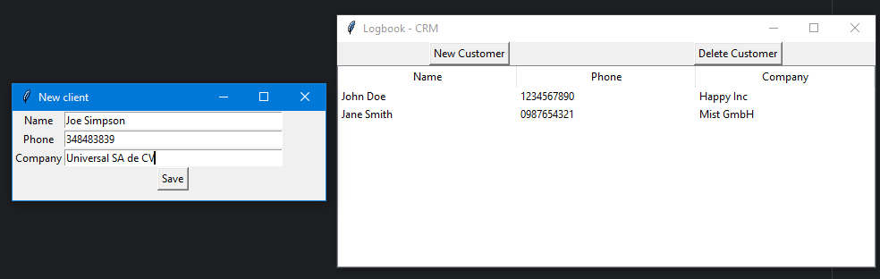
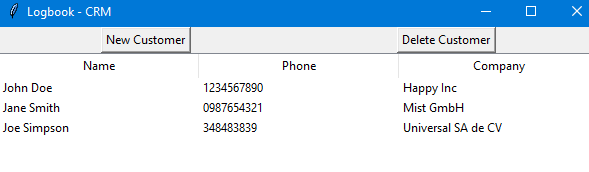
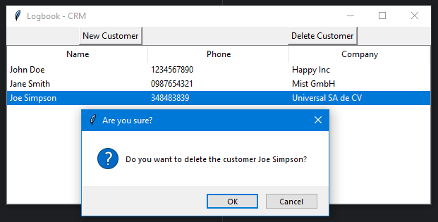
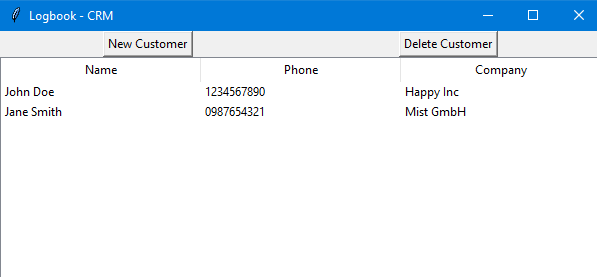

# Tkinter basics

This is a repo to recap the basics of Tkionter which is a library that allows you to create desktop apps with Python.
You will find the basic UI elements applied in examples and the next projects using some of these elements:

### Feet to meters calculator
Enter a number and click calculate to see the value in meters

### Calculator
Basic calculator

### Image Carousel
You can see images in a carousel, it includes a back button and a next button to change the image.

### Todo app:
It uses a sqlite database to persist the data.

### Logbook - small CRM
It also uses a sqlite database to save data. It includes a button to add new customers and also a button to delete them.
When you click on "New Customer" a new window is opened with the form to capture the data:

When you click on "Delete Customer", a confirmation message allows you to confirm the action or cancel it.

## How to run the projects

1. Clone the repo.
2. Open the folder with your favorite python code editor.
3. Run each script file separately from the "projects" folder (each file is in a sub-folder with the name of each project)

